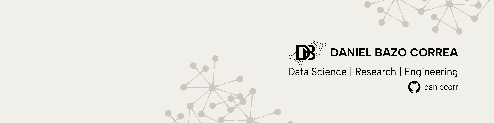

  

<h1 align="center">
  Hi, I'm Daniel 
</h1>

  <strong>Data Scientist at Ericsson | R&D ML Engineer | Electronic Systems Engineer</strong>

  

## About Me

Hi, I'm Daniel.

I am a Data Scientist at Ericsson, working within the Cognitive Software Engineering
team. My role focuses on developing prototypes and improving existing products by
applying AI to telecommunications challenges.

I am interested in the intersection of research and software engineering. I apply
techniques like Deep Learning, Signal Processing, and Computer Vision to build tools for
mobile network optimization, always focusing on writing clean and reliable code. I also
contribute to internal libraries that help our R&D teams work more efficiently.
